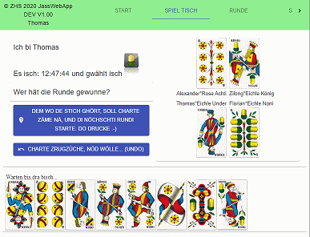

# JassWebApp
Swiss jass card game

Designed to play together during corona time. The rules are not implemented, so be vigilant, players ca break rules like playing with real cards on a table.

Unique game in the world counter clockwise.

All text are in swiss german dialect region St.Gallen :-)

If you want to know more about the basic Jass Rules, check out this site: http://www.jassinfo.ch/f_jassregeln.html

# How to start the game:
## Supervisor Page
* Use this page to define the names of players
* Choose basic rules

# Setup developer environment
## React UI
start_react_dev NPM SCRIPT will start server o port 3000. By default this environment will connect to localhost:3001 webservices.
## Node test webservices
node_express_server NPM SCRIPT will start the webservice server. If you build the application you can access also directly to localhost:3001 to see if the build Jass Web App works.

# Build and deploy
build_react builds the React UI files un the build folder. Thes folder is mounted as file folder inside the express server.

The ftp deploy scripst trasfers the build folder to the jass.zhs.ch server.
